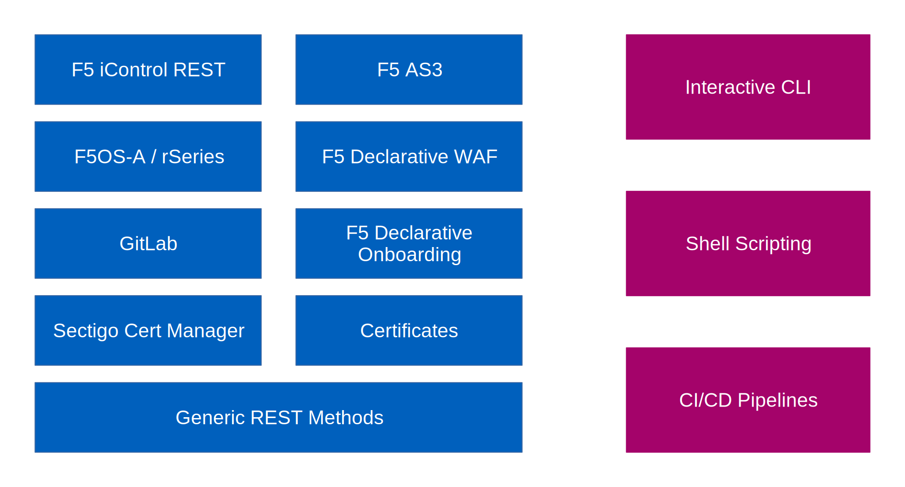

Restsh
======

Restsh is a shell for REST APIs. It can be used interactively or in scripts. Restsh forms the basis of all pipelines of
the Axians Automation Framework.

Reference
---------

.. toctree::
   :glob:
   :hidden:

   Installation.rst
   Usage.md
   EXAMPLES.md
   UsageF5.md
   EXAMPLES.F5.md
   UsageF5OSA.md
   UsageGitLab.md
   UsageSCM.md
   DEVELOPING.md
   GeneralFunctions/index.rst
   modules/index.rst
   CHANGELOG.md
   *

-  :doc:`General <Usage>`
-  :doc:`Functions <GeneralFunctions/index>`
-  :doc:`Modules <modules/index>`

   -  :doc:`F5 TMOS <UsageF5>`
   -  :doc:`F5OS-A / rSeries <UsageF5OSA>`
   -  :doc:`GitLab <UsageGitLab>`
   -  :doc:`Sectigo Cert Manager <UsageSCM>`
   -  :doc:`Certificates <modules/cert/index>`
